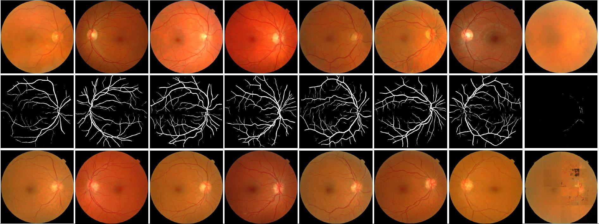
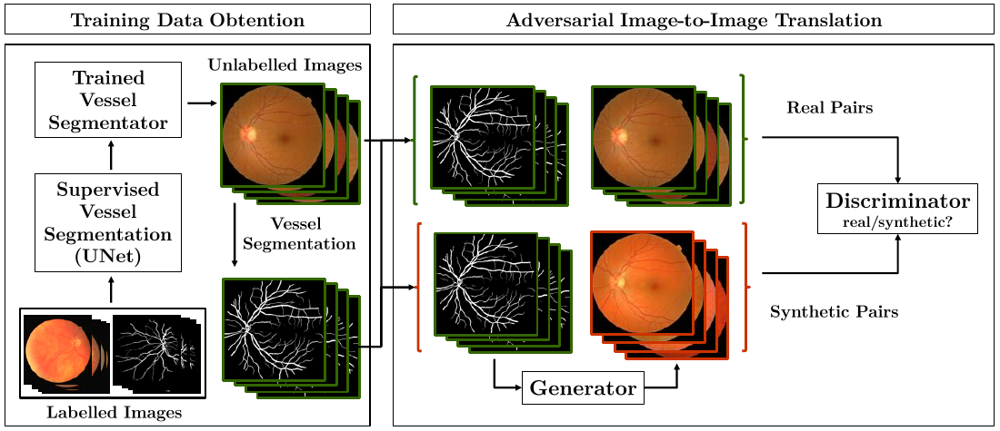

# Towards Adversarial Retinal Image Synthesis

[Arxiv](https://arxiv.org/abs/1701.08974) [Demo](http://vess2ret.inesctec.pt)

We use an image-to-image translation technique based on the idea of adversarial learning to synthesize eye fundus images directly from data. We pair true eye fundus images with their respective vessel trees, by means of a vessel segmentation technique. These pairs are then used to learn a mapping from a binary vessel tree to a new retinal image.




## How it works
- Get pairs of binary retinal vessel trees and corresponding retinal images
   The user can provide their own vessel annotations.
   In our case , because a large enough manually annotated database was not available we applied a DNN vessel segmentation method on the [Messidor database](http://www.adcis.net/en/Download-Third-Party/Messidor.html). For details please refer to [arxiv](https://arxiv.org/abs/1701.08974).

- Train the image generator on the set of image pairs.
   The model was based in [pix2pix](https://github.com/phillipi/pix2pix). We use a Generative Adversarial Network and combine the adversarial loss with a global L1 loss. Our images have 512x512 pixel resolution. The implementation was developed in Python using Keras.


- Test the model.
   The model is now able to synthesize a new retinal image from any given vessel tree.

<p align="center">
 
</p>

## Setup

## Prerequisites
- Keras (Theano or Tensorflow backend) with the "image_dim_ordering" set to "th"

### Set up directories

The data must be organized into a train, validation and test directories. By default the directory tree is:

  * 'data/unet_segmentations_binary'
    * 'train'
        * 'A', contains the binary segmentations
	    * 'B', contains the retinal images
	* 'val'
	    * 'A', contains the binary segmentations
	    * 'B', contains the retinal images
	* 'test'
	    * 'A', contains the binary segmentations
	    * 'B', contains the retinal images

The defaults can be changed by altering the parameters at run time:
   ```bash
   python train.py [--base_dir] [--train_dir] [--val_dir]
   ```
Folders {A,B} contain corresponding pairs of images. Make sure these folders have the default name. The pairs should have the same filename.

## Usage

## Model

The model can be used with any given vessel tree of the according size. You can download the pre-trained weights available [here](https://drive.google.com/drive/folders/0B_82R0TWezB9VExYbmt2ZUJSUmc?usp=sharing) and load them at test time. If you choose to do this skip the training step.

### Train the model

   To train the model run:

   ```bash
   python train.py [--help]
   ```
   By default the model will be saved to a folder named 'log'.

### Test the model

   To test the model run:

   ```bash
   python test.py [--help]
   ```
   If you are running the test using pre-trained weights downloaded from [here](https://drive.google.com/drive/folders/0B_82R0TWezB9VExYbmt2ZUJSUmc?usp=sharing) make sure both the weights and params.json are saved in the log folder.


## Citation
If you use this code for your research, please cite our paper [Towards Adversarial Retinal Image Synthesis](https://arxiv.org/abs/1701.08974):

```
@article{ costa_retinal_generation_2017,
  title={Towards Adversarial Retinal Image Synthesis},
  author={ Costa, P., Galdran, A., Meyer, M.I., Abràmoff, M.D., Niemejer, M., Mendonca, A.M., Campilho, A. },
  journal={arxiv},
  year={2017},
  doi={10.5281/zenodo.265508}
}
```

[](https://doi.org/10.5281/zenodo.265508)
